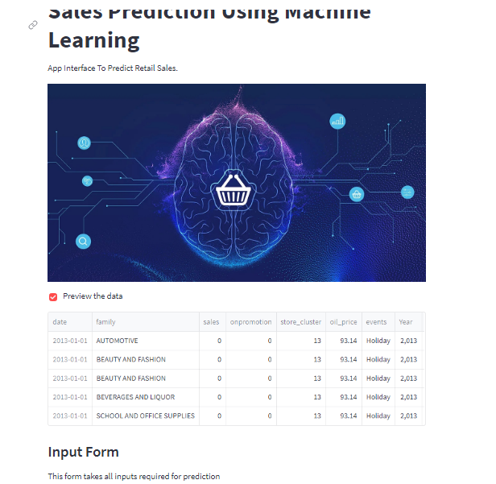

# Embedding ML Models in GUI

## Project Description
This project uses open source tools (streamlit and gradio) to create friedly user interface for machine leaning models

## Setup and Execution
To run this file
1. Required python3 installed on your machine
2. Install streamlit and gradio
3. Ensure all url in script match your file loactions
4. It is not required but advisable to create a virtual environment

